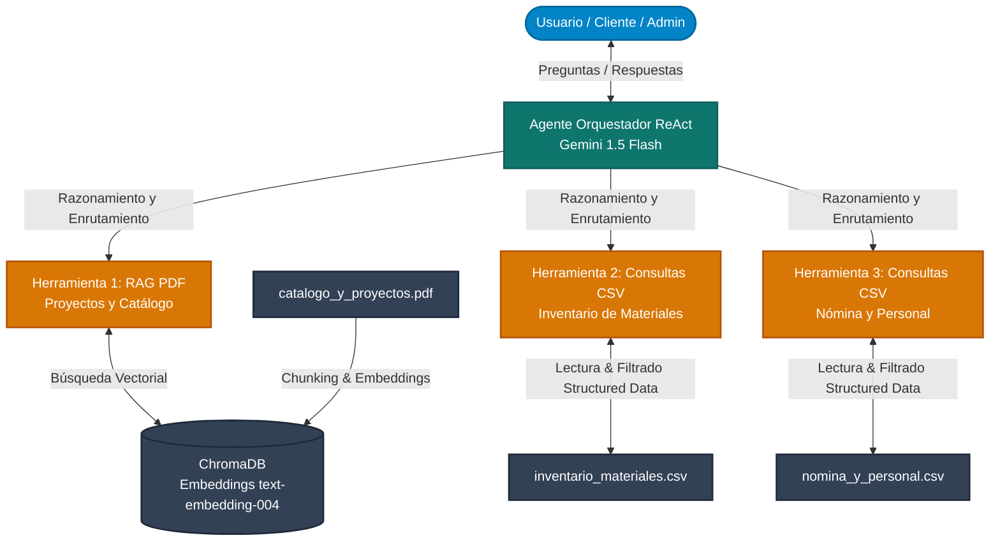

# BuildTechAI-Agent — Agente Inteligente para Gestión Constructora

[](https://www.python.org/)
[](https://www.langchain.com/)
[](https://ai.google.dev/)
[](https://www.trychroma.com/)
[](https://www.oracle.com/cloud/)

> **Proyecto desarrollado para el Challenge Alura Latam / Oracle Cloud Infrastructure (OCI)**  
> Es un Agente multi-herramienta con IA capaz de resolver consultas operativas en lenguaje natural sobre **Captación de Clientes y Proyectos**, **Gestión de Inventario** y **Nómina de Personal/Subcontratistas** para la empresa *Constructora Nova Build SpA*.


## Contexto del Problema

En las empresas de la construcción, la información crítica suele encontrarse dispersa entre catálogos de obras en PDF, hojas de cálculo de insumos de bodega y listas de asistencia o contratos de personal. Esta fragmentación genera pérdida de tiempo operativo y demoras en las respuestas a clientes y directores de obra.

**BuildTech AI Agent** unifica el acceso a estos silos documentales mediante un sistema **RAG (Retrieval-Augmented Generation)** y análisis tabular interactivo.


## Arquitectura del Sistema

El agente utiliza un orquestador basado en la lógica **ReAct (Reasoning + Acting)** que enruta las preguntas del usuario hacia la herramienta especializada según el tipo de consulta:



### Componentes del Sistema

1. **Agente Orquestador (ReAct - Gemini 1.5 Flash):**
   * Recibe la consulta en lenguaje natural y decide de forma autónoma cuál herramienta invocar según la intención detectada.
2. **Herramienta 1: RAG PDF (Catálogo y Proyectos):**
   * Realiza búsqueda semántica sobre documentos no estructurados (`catalogo_y_proyectos.pdf`) utilizando **ChromaDB** y **Google Text Embeddings**.
3. **Herramienta 2: Gestión de Inventario (CSV):**
   * Consulta datos estructurados (`inventario_materiales.csv`) para responder sobre stock, ubicaciones en bodega y precios al por mayor.
4. **Herramienta 3: Nómina y Personal (CSV):**
   * Consulta datos estructurados (`nomina_y_personal.csv`) sobre el equipo de trabajo, certificaciones, subcontratistas y posibilidades de ascenso.


## Stack Tecnológico

* **Lenguaje principal:** Python 3.10+
* **Orquestación de IA:** LangChain / LangGraph
* **Modelo de Lenguaje (LLM):** Google Gemini 1.5 Flash
* **Vector Database:** ChromaDB (`text-embedding-004`)
* **Procesamiento de Datos:** Pandas, PyPDF, WeasyPrint
* **Infraestructura Cloud:** Oracle Cloud Infrastructure (OCI) — Instancia OCI Compute (Ubuntu Server)


## Estructura del Repositorio

```text
├── constructora_data/
│   ├── catalogo_y_proyectos.pdf   # Documento no estructurado (Catálogo y Obras)
│   ├── inventario_materiales.csv  # Base estructurada de insumos y proveedores
│   └── nomina_y_personal.csv      # Base estructurada de personal y subcontratistas
├── src/
│   ├── agente_constructora.py     # Script principal del agente multi-herramienta
│   └── generate_data.py           # Generador del dataset inicial
├── constructora_buildtech_agent.ipynb # Notebook ejecutable en Google Colab
├── DEPLOYMENT.md                  # Guía de despliegue en OCI Compute
├── .env.example                   # Plantilla de variables de entorno
├── requirements.txt               # Lista de dependencias del proyecto
├── .gitignore                     # Archivos excluidos del control de versiones
└── README.md                      # Documentación del proyecto
```

##  Ejemplos de Consultas Resueltas por el Agente
1. Captación y Comercial (PDF - RAG)
Pregunta: "¿Qué porcentaje de avance tiene la Torre Miramar y qué opinan sus clientes?"

Respuesta del Agente: La Torre Miramar en Valparaíso presenta un 65% de avance en su ejecución. Inmobiliaria del Mar destacó la precisión en los plazos y la alta resistencia de la estructura ante marejadas e inviernos.

2. Gestión de Inventarios (CSV - Pandas)
Pregunta: "¿Cuál es la distribuidora que nos vende Cemento Melón y qué precio ofrece al por mayor?"

Respuesta del Agente: El proveedor principal es Distribuidora El Teniente. El precio unitario es de $4.800 CLP, pero ofrece un precio al por mayor de $4.200 CLP a partir de 100 sacos.

3. Nómina y Talento (CSV - RRHH)
Pregunta: "¿Qué trabajadora o subcontratista cuenta con certificación LEED y tiene posibilidad de ascenso?"

Respuesta del Agente: María Paz Salamanca, Ingeniera Civil Estructural, cuenta con la certificación LEED Green Associate y está catalogada como candidata a Jefa de Proyecto.


## Instalación y Ejecución Local
1. Clonar el repositorio
```Bash
git clone https://github.com/JellySav/BuildTechAI-Agent.git
cd BuildTechAI-Agent
```

2. Crear un entorno virtual e instalar dependencias
```Bash
python3 -m venv venv
source venv/bin/activate  # En Windows: venv\Scripts\activate
pip install -r requirements.txt
```

3. Configurar variables de entorno
Crea un archivo .env basado en .env.example:
```bash
Fragmento de código
GOOGLE_API_KEY="TU_GEMINI_API_KEY"
```

4. Ejecutar el agente
```Bash
python src/agente_constructora.py
```

## Deploy en Oracle Cloud Infrastructure (OCI)
El agente está diseñado para ejecutarse tanto en entornos locales/Colab como desplegado en una instancia **OCI Compute (Ampere ARM / Ubuntu 22.04)** de Oracle Cloud Infrastructure.

Para ver las instrucciones detalladas de aprovisionamiento de servidor, configuración de entorno, variables y daemonización con `systemd`, consulta la [Guía de Despliegue en OCI (DEPLOYMENT.md)](./DEPLOYMENT.md).


# Evidencia de Despliegue en OCI

Puedes revisarlo a través de su IP pública:
```
Entorno Cloud: Oracle Linux / Ubuntu Server en OCI.
Estado de la Instancia: Active / Running
Ip Pública / Endpoint de prueba: http://<IP_PUBLICA_OCI>:8000 
```
*Nota: Si se consulta posteriormente a la revisión del reto, es probable que no esté disponible debido al ciclo de vida del servidor*


También puedes verificar la ejecución mediante las siguientes capturas de pantalla:


*Captura de pantalla: Respuesta del endpoint HTTP en el puerto 8000.*


*Captura de pantalla 2: Estado del servicio daemonizado en la instancia OCI.*


## Autor / Créditos

Desarrollado como parte del Challenge Alura Latam & Oracle Next Education (ONE).

* **Desarrollado por:** Yael (Eavny)
* **Contacto:** [Mi LinkedIn](https://www.linkedin.com/in/yael-astorga-computer-science-student/)
